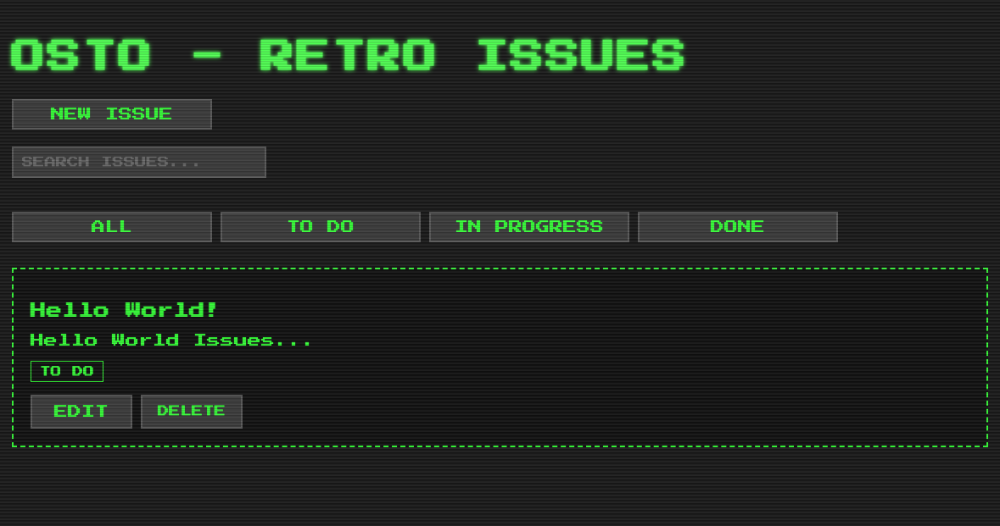

# OSTO - Retro Issue Manager

A retro-styled issue tracking application built with Ruby on Rails, featuring a nostalgic CRT monitor effect and pixel-art inspired design.



## Features

- Create, edit, and delete issues
- Filter issues by status (To Do, In Progress, Done)
- Search functionality
- Retro CRT monitor effect
- Pixel-art inspired UI elements

## Prerequisites

- Ruby 3.2.2 or higher
- Rails 7.1.0 or higher
- SQLite3

## Installation

1. Clone the repository:
```bash
git clone <repository-url>
cd OSTO
```
2. Install dependencies:
```bash
bundle install
```
3. Set up the database:
```bash
rails db:create
rails db:migrate
```
4. Start the server:
```bash
rails server
```
5. Open your web browser and visit  Open your web browser and visit localhost:3000 to access the application.

## Usage
- Create New Issue : Click the "NEW ISSUE" button
- Filter Issues : Use the status buttons (ALL, TO DO, IN PROGRESS, DONE)
- Search : Type in the search bar to find specific issues
- Edit/Delete : Use the buttons on each issue card

## Design
The application features a retro-inspired design with:

- Press Start 2P font for authentic retro typography
- CRT monitor scan line effect
- Neon green color scheme
- Pixel-art inspired buttons and UI elements

## Development
The application is built with:

- Ruby on Rails for the backend and frontend
- SQLite3 for the database
- Pure CSS for styling
- Press Start 2P Google Font for typography

## Contributing
1. Fork the repository
2. Create your feature branch ( git checkout -b feature/amazing-feature )
3. Commit your changes ( git commit -m 'Add some amazing feature' )
4. Push to the branch ( git push origin feature/amazing-feature )
5. Open a Pull Request

## License
This project is licensed under the MIT License - see the LICENSE.md file for details.

## Author
Melih Birim - @melihbirim

## Acknowledgments
- Inspired by classic 90s software interfaces
- Press Start 2P font by CodeMan38